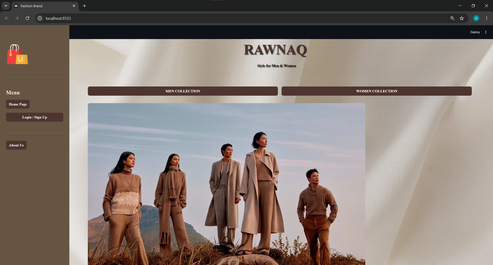
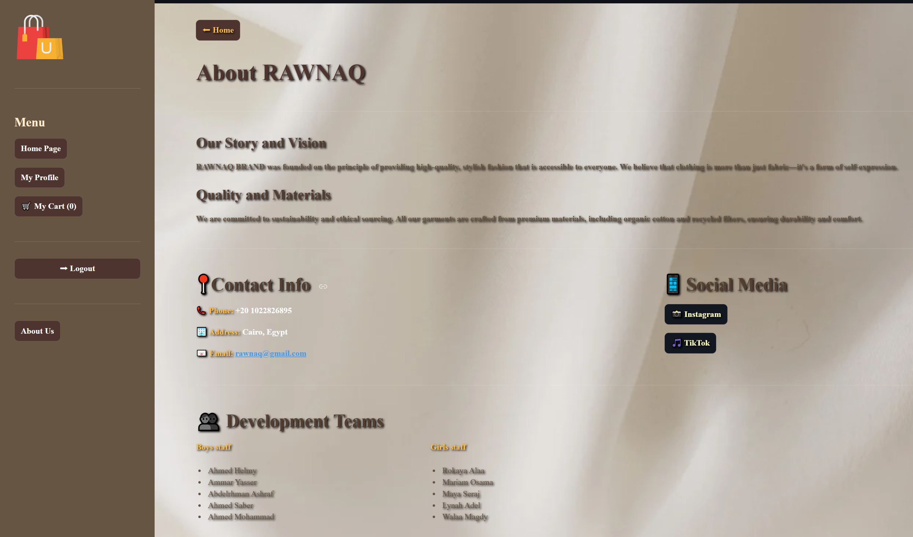
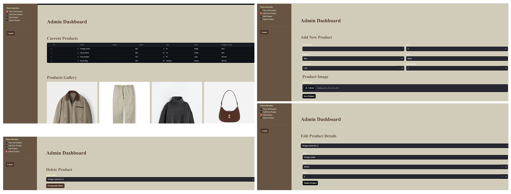
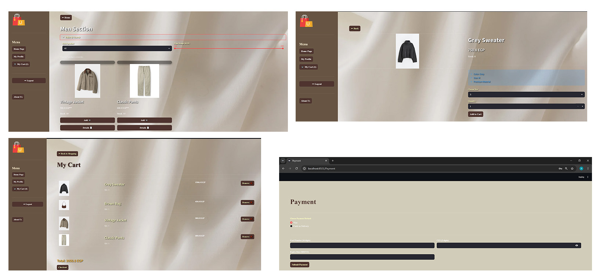

# 🛍️ Rawnaq Brand — E-Commerce Platform

A full-stack e-commerce web application built with Streamlit and SQLite for **RAWNAQ BRAND**, a real retail fashion brand based in Cairo, Egypt. The platform bridges their physical stores and social media presence with a complete digital shopping experience.

---

## 🎬 Demo

[](your-linkedin-video-link-here)

---
## 🖼️ Screenshots

| Homepage | About |
|----------|-------|
|  |  |

| Dashboard | How To Order |
|-----------|---------|
|  |  |
---

## 🚀 Features

### 🌟 Consumer Storefront
- Immersive landing page with custom CSS glassmorphism design
- Product browsing split into Men & Women collections
- Multi-parametric search: filter by type and price range slider
- Session-persistent shopping cart with quantity control and real-time stock limits
- Customer profile hub — update display name and password

### 💳 Checkout Engine
- Multi-channel payment: Credit Card (16-digit + CVV validation) & Cash on Delivery
- Real-time stock deduction upon order completion
- Advanced session state routing for high-integrity checkout flow

### 🔑 Authentication & Role-Based Access
- Secure login and registration system
- Role-based access control: `user` vs `admin`
- Admin routes blocked from unauthorized access

### 🔒 Admin Dashboard
- Full inventory CRUD: Create, Read, Update, Delete products
- Live stock tracking with visual product gallery
- Image upload with Unix-timestamped secure filenames
- Interactive data tables for inventory auditing

---

## 🗄️ Database Schema (SQLite)

| Table | Description |
|-------|-------------|
| `users` | Identity, password hashes, phone, address, role |
| `categories` | Fashion branches (Men, Women) |
| `products` | Name, category, size, color, price, stock quantity |
| `cart` | Junction table — customer ↔ product selections |
| `orders` | Order records with billing and tracking details |
| `payments` | Financial logs and payment method records |
| `feedback` | User feedback and satisfaction ratings |

---

## 🛠️ Tech Stack


---

## 📁 Project Structure

```
rawnaq-brand/
│
├── Homepage.py             
├── team5.py                 
├── init_db.py
├── docs/          
├── pages/
│   ├── Admin_Dashboard.py  
│   ├── Payment.py           
│   └── Register.py         
├── images/                  
├── screenshots/            
├── requirements.txt
└── README.md
```
## 📄 Documentation
- [System Requirements Specification (SRS)](docs/SRS.pdf)
- [System Diagram](docs/diagram.png)
---

## 🚀 How to Run

```bash
git clone https://github.com/v7med7elmy-ai/rawnaq-brand.git
cd rawnaq-brand
pip install -r requirements.txt
streamlit run Homepage.py
```

---

## 📍 About Rawnaq Brand

A real retail fashion outlet operating out of Cairo, Egypt — curating premium garments for modern self-expression.

- 📸 Instagram: [@rawnaq_shop28](https://instagram.com/rawnaq_shop28)
- 🎵 TikTok: [@rawnaq_shop_](https://tiktok.com/@rawnaq_shop_)

---

## 👥 Team

Built by a team of 10 AI Engineering students — Menoufia University.

**My Role: Core Developer**
- Built the entire Homepage (frontend + backend)
- Developed core database API layer (`team5.py`)
- Integrated all team members' code into one working app
- Resolved all integration bugs and linking issues

---

## 👤 Author

**Ahmed Helmy** — AI Engineering Student
[GitHub](https://github.com/v7med7elmy-ai) • [LinkedIn](https://www.linkedin.com/in/ahmed-helmy-ai)
